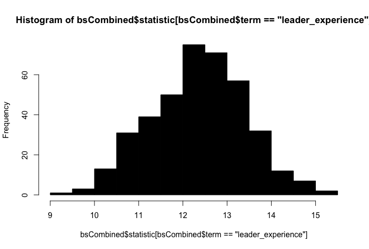

# Analyzing What Makes an Effective Leader

### What-Makes-an-Effective-Leader:

Why are some managers better than others? Are there any general behaviors or characteristics that help a leader be perceived as more effective? The data I use in this analysis was given to me by Seth Berry and originates from a large survey of employees and their direct manager. In this dataset, each leader provided self-ratings and their direct subordinates provided rating about the leader. This is reflected by the `Rater` variable.  The data is structured the following way:

The *forceful* scale contains the following subscales: takes charge, declares, pushes

The *enabling* scale contains the following subscales: empowers, listens, supports

The *strategic* scale contains the following subscales: direction, growth, innovation

The *operational* scale contains the following subscales: execution, efficiency, order 

### Libraries Used in This Proejct:

```{r}
library(tidyverse)
library(pwr)
library(ggplot2)
library(MASS)
load("teamPerc.rdata")
teamPerc_1 <- teamPerc
```

### Three Hypotheses:

Hypotheses 1:

  - Leaders with more years of experience will have a higher effect rating than leaders with less years of experience.

  - If we compare the effect ratings of leaders with more years of experience with leaders with less years of experience, then we will see that leaders with more years of experience will have a higher effect rating.

  - h0: 
  
    - The effect rating for leaders with more years of experience = The effect rating for leaders with less years of experience

  - h1: 

    - The effect rating for leaders with more years of experience > The effect rating for leaders with less years of experience
  
Hypothesis 2:

  - Leaders who follow up with their employees (lvi40) will have a higher effect rating than leaders who do not follow up with their employees

  - If we compare the effect ratings of leaders who follow up with their employees with leaders who do not, then we will see that leaders who follow up with their employees have a higher effect rating.

  - h0: 
  
    - The effect rating for leaders who follow up with their employees = The effect rating for leaders who do not follow up with their employees

  - h1: 

    - The effect rating for leaders who follow up with their employees > The effect rating for leaders who do not follow up with their employees

Hypothesis 3: 

  - Leaders who are deemed forceful will have a lower effect rating than leaders who are not deemed forceful.

  - If we compare the effect ratings of leaders, who are deemed forceful with their employees with leaders who are not, then we will see that leaders who are forceful with their employees have a lower effect rating.

  - h0: 
  
    - The effect rating for leaders who are forceful with their employees = The effect rating for leaders who are not forceful with their employees

  - h1: 

    - The effect rating for leaders who are forceful with their employees < The effect rating for leaders who are not forceful with their employees

### Power Analysis:

Before I built any models, I decided to conduct an *a prior* power analysis and determine the sample size needed.


Below, I outputted the convential effect sizes.

```{r}
pwr::cohen.ES("f2", "small")
```


```{r}
pwr::cohen.ES("f2", "medium")
```


```{r}
pwr::cohen.ES("f2", "large")
```


```{r}
pwr.f2.test(u = 1, v = NULL, f2 = .02, power = .8)
```


```{r}
pwr.f2.test(u = 1, v = NULL, f2 = .02, power = .8)
```


```{r}
pwr.f2.test(u = 1, v = NULL, f2 = .02, power = .8)
```


Notes about Power Analysis:
  
  - Power was set to 0.8. This represents a ratio of 4:1 between Type II and Type I. 
  
  - This data set is based on human interactions. Due to this, I expect all of the effects to be small. Thus, I set the f2 value to 0.02.
  
  - U was set to one because for every model k = 2 a and u = df(k-1). Thus, u = 1.
  
  - Finally, v was set to NULL because we are trying to calculate how many observations are needed for this model to be valid.
  
After conducting your power analysis, use linear regression to test your hypotheses and produce appropriate visualizations.

### Graphs and linear Regression:

#### Experience:

```{r}
experience_model <- lm(effect ~ leader_experience, data = teamPerc_1)
summary(experience_model)
```


```{r}
ggplot(teamPerc_1, aes(leader_experience, effect)) +
  geom_point() + geom_smooth(method = "lm") + 
  ggtitle("Leader Experience Graph") + theme_classic()
```


As the graph titled "Leader Experience Graph" shows, as leaders gain experience, they typically have a more significant effect on their employees. This is also demonstrated by having a positive coefficient estimate for the variable leader_experience. It should be noted that the model only has an Adjusted R-squared value of 0.004406. This is an extremely low adjusted r squared, which is to be expected anytime someone is attempting to describe human behavior. However, as the graph shows, there are many data points, and this data should be investigated further. Thus, based on the model and graph, I reject my null hypothesis and accept my alternative hypothesis.

#### Follow Up:

```{r}
follow_up_model <- lm(effect ~ lvi40, data = teamPerc_1)
summary(follow_up_model)
```


```{r}
ggplot(teamPerc_1, aes(lvi40, effect)) +
  geom_point() + geom_smooth(method = "lm") + 
  ggtitle("Follow Up Graph") + theme_classic()
```


The first item that should be noted regarding this data is that the variable "lvi40," which represents the amount the leader follows up, is not a continuous variable. With this being said, the estimated coefficient for lvi40 is 0.232082, which is positive and suggests that leaders have a more significant effect when they follow up with their employees. The trend line confirms this on the graph titled "Follow Up Grap," which has a positive slope. Once again, the Adjusted R-squared value is low, which we expected because we are working with human behavior data. Due to this and the linear model, I reject my null hypothesis and accept my alternative hypothesis. 

#### Forceful:

```{r}
forceful_model <- lm(effect ~ forceful, data = teamPerc_1)
summary(forceful_model)
```


```{r}
ggplot(teamPerc_1, aes(forceful, effect)) +
  geom_point() + geom_smooth(method = "lm") + 
  ggtitle("Forceful Graph") + theme_classic()
```


Finally, the last model I created was forceful, and its impact on the leader's overall effectiveness My thinking behind my hypothesis was that leaders who were forceful with their employees were going to have a negative impact on their employees. This is demonstrated by the fact that the estimated coefficient value of -0.050922 and the graph "Forceful Graph" has a downward sloping trend line. As mentioned in previous model analysis, the Adjusted R-squared value was low, but we expected this. Based on this, I once again reject my null hypothesis and accept my alternative.

### Sampling Data:

The calculations performed earlier determined that the required number of observations is 392.373. Due to this, I am going to resample the data and use 393 observations. In addition, I am going to use bootstrapping to take full samples out of the original data set. 

```{r}
silver_var <- dplyr::select(teamPerc_1, effect, leader_experience, lvi40, forceful)
bootstrapping <- function(df) {
  df <- df
  
  sampleValues <- sample(1:nrow(df), nrow(df), replace = TRUE)
  
  df <- df[sampleValues, ]
  
  bsMod <- lm(effect ~ forceful + lvi40 + leader_experience, data = df)
  
  results <- broom::tidy(bsMod)
  
  return(results)
}

bootstrapping(silver_var)

bsRep <- replicate(393, bootstrapping(silver_var), simplify = FALSE)

bsCombined <- do.call("rbind", bsRep)

hist(bsCombined$statistic[bsCombined$term == "forceful"], col = 'black')
```


Pictured above is the histogram of forceful and the frequency that it occurs. The first item that should be addressed is that the absolute value of statistics form the bootstrap model is 14. This is significantly larger than 1.96, which is the generally accepted threshold for significance. In addition, the entire resultant distribution is between -10 and -20, which demonstrates that it is significant within the redistribution. This supports the conclusion to reject the null hypothesis and accept the alternative hypothesis. 

```{r}
hist(bsCombined$statistic[bsCombined$term == "lvi40"], col = 'black')
```


This graph depicts a histogram of lvi40, which is whether leaders follow up with their employees. The distribution of the data is between 24 and 34. This is above the 1.96 thresholds for significance. Due to this, the resultant distributions support my hypothesis and conclusions I reached earlier in the bronze section.

```{r}
hist(bsCombined$statistic[bsCombined$term == "leader_experience"], col = 'black')
```



Finally, the last histogram shows the forceful and the frequency it occurs. The distribution of the data is between 9 and 16. Thus, the model is greater than the 1.96 thresholds for statistical significance. This supports the conclusions I reached earlier in regards to my hypothesis. 

### Review Models:

Finally, I wanted to explore if there were any issues in the regression models, such as the standard errors, that I ran. I wanted to determine if there were any observations that exhibited significant leverage.

```{r}
par(mfrow = c(2,2))
plot(experience_model)
```


```{r}
plot(follow_up_model)
```


```{r}
plot(forceful_model)
```


In all of the above models, there were observations exerting significant leverage on the residuals. This is due to some observations being outliers within the data set. Thus, the models have to redone using the MASS package and focusing on the least squares. To do this, I am going to do bisqaure weighting, which will down weight every residual that is not zero and in turn, pull the estimated coefficients in the regression down. 

```{r}
forceful_model_bi <- rlm(effect ~ forceful, data = teamPerc_1, psi = psi.bisquare)
follow_up_model_bi <- rlm(effect ~ lvi40, data = teamPerc_1, psi = psi.bisquare)
experience_model_bi <- rlm(effect ~ leader_experience, data = teamPerc_1, psi = psi.bisquare)

summary(forceful_model_bi)
```


```{r}
summary(follow_up_model_bi)
```

"

```{r}
summary(experience_model_bi)
```


As we expected, the new models reduced the standard error.

